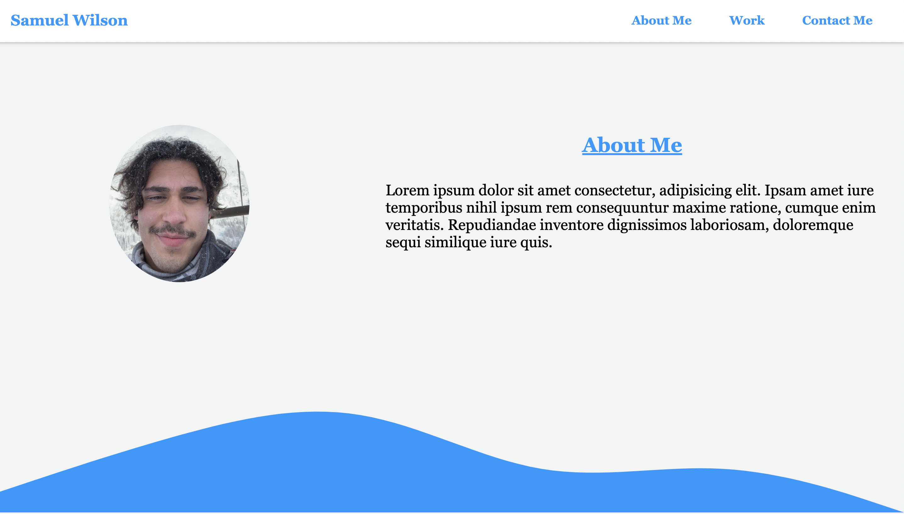

# Portfolio

## Description

The purpose behind this project was to create a website that allows me to showcase my work to future employers in a clean and efficient way. As this was the first website I have created from scratch it was difficult but also was very good for me as it allowed me to experiment with the topics I have learned in my course and feel more comfortable with both HTML and CSS.

## Installation

N/A

## Usage

The way this site should be used is to navigate through my work and see examples of what I am capable of so that an emplyer can decide whether or not they are interested in hiring me. On the navigation bar you can click the links to learn more about me, see my work, or contact me.

## Credits

N/A

## License

Refer to LICENCE in repo.
